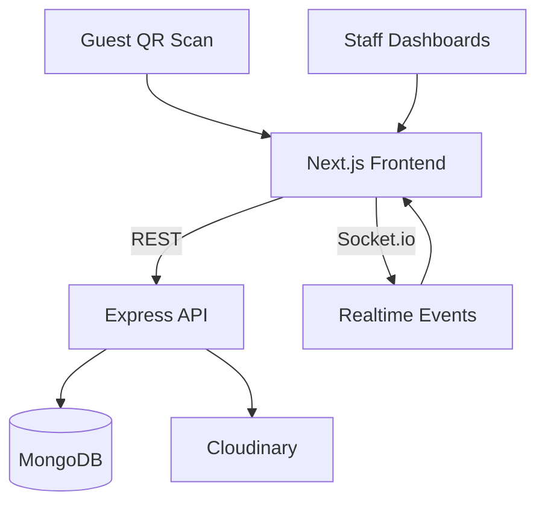

# QRDine

A QR-based restaurant ordering system with a premium guest flow, real-time kitchen updates, and role-based staff dashboards. Guests scan a QR, browse menus, place orders, and track status while the kitchen and staff see live updates.

## Quick Links
- [Overview](#overview)
- [Features](#features)
- [Tech Stack](#tech-stack)
- [Roles And Screens](#roles-and-screens)
- [Architecture](#architecture)
- [Getting Started](#getting-started)
- [Environment Variables](#environment-variables)
- [Scripts](#scripts)
- [API Surface](#api-surface)
- [Realtime Events](#realtime-events)
- [Project Structure](#project-structure)
- [Troubleshooting](#troubleshooting)

## Overview
QRDine streamlines the in-cafe ordering experience. Customers open a cafe-specific menu by scanning a QR code. Orders flow to the kitchen instantly, while staff dashboards show table status, order progress, and payment state.

## Features
- QR-based guest entry into cafe-specific menus
- Customer ordering flow with table association
- Real-time order updates (Socket.io)
- Role-based staff experiences (super admin, cafe admin, kitchen/chef, waiter)
- Menu and media management with Cloudinary
- Table status tracking (free, reserved, served, paid)
- OTP verification endpoints for phone-based flows
- Cafe configuration and multi-cafe support

## Tech Stack
- Frontend: Next.js 14, React 18, Tailwind CSS
- Backend: Node.js, Express, MongoDB (Mongoose)
- Realtime: Socket.io
- Media: Cloudinary
- Auth: JWT

## Roles And Screens
- Guest: QR scan, browse menu, place order, track status
- Cafe Admin: menu, tables, staff, and cafe settings
- Kitchen/Chef: live order queue and status updates
- Waiter/Staff: table view and order lifecycle
- Super Admin: multi-cafe oversight

Tip: The marketing-style landing page lives at `next-frontend/app/page.js` and can be customized per brand.

## Architecture


## Getting Started
### Prerequisites
- Node.js 18+
- MongoDB (local or Atlas)

### Install
```bash
# Frontend
cd next-frontend
npm install

# Backend
cd ../server
npm install
```

### Run
```bash
# Backend (API)
cd server
npm run start

# Frontend (Next.js)
cd ../next-frontend
npm run dev
```

Open `http://localhost:3000` for the frontend and `http://localhost:5000` for the API.

### Seed Demo Users
```bash
cd server
npm run seed:users
```
The seed script creates demo users for local testing and prints credentials. Change these before production use.

## Environment Variables
Create your environment files using the templates below.

### Frontend (`next-frontend/.env.local`)
```
NEXT_PUBLIC_API_BASE_URL=http://localhost:5000
NEXT_PUBLIC_CLOUDINARY_CLOUD_NAME=your_cloud_name_here
```

### Backend (`server/.env`)
```
MONGODB_URI=your_mongodb_connection_string
PORT=5000
JWT_SECRET=your_jwt_secret

# Cloudinary
CLOUDINARY_CLOUD_NAME=your_cloud_name
CLOUDINARY_API_KEY=your_cloud_key
CLOUDINARY_API_SECRET=your_cloud_secret
CLOUDINARY_URL=cloudinary://<key>:<secret>@<cloud_name>

# OTP settings
OTP_TTL_SECONDS=300
OTP_MAX_ATTEMPTS=5
```

Security note: Do not commit real secrets. Keep production credentials in a secret manager.

## Scripts
### Frontend (`next-frontend/package.json`)
- `npm run dev` - start Next.js dev server
- `npm run build` - build for production
- `npm run start` - run production build
- `npm run lint` - run linter

### Backend (`server/package.json`)
- `npm run start` - start API with Nodemon
- `npm run seed:users` - seed demo users

## API Surface
Base paths used by the backend:
- `POST /api/auth/login` and `POST /api/auth/register`
- `POST /api/auth/otp/request` and `POST /api/auth/otp/verify`
- `GET /api/menu` and menu filters
- `GET /api/cafe/:id` for cafe details
- `POST /api/orders` and `PATCH /api/orders/:id`
- `GET /api/orders/cafe/:cafeId` and `GET /api/orders/table/:cafeId/:tableNumber`
- Admin: `/api/admin/*` and `/api/superadmin/*`

See the `server/routes` folder for full route definitions.

## Realtime Events
Socket rooms are per-cafe. The frontend joins using `JOIN_CAFE` with `{ cafeId }`. Staff dashboards send a JWT in the Socket.io `auth` handshake so the server only allows joining rooms for that user?s cafe; guest customers connect without a token (live order updates only).

Emitted events:
- `NEW_ORDER`
- `ORDER_UPDATED`
- `ORDER_READY`
- `ORDER_PAID`

## Project Structure
```
.
+-- next-frontend
?   +-- app
?   +-- components
?   +-- lib
?   +-- public
+-- server
?   +-- config
?   +-- controllers
?   +-- models
?   +-- realtime
?   +-- routes
?   +-- services
+-- README.md
```

## Troubleshooting
- Auth error about missing JWT: set `JWT_SECRET` and ensure `jsonwebtoken` is installed in `server`.
- Realtime not working: ensure `socket.io` is installed and the frontend connects to the same API base URL.
- Cloudinary images not loading: confirm `NEXT_PUBLIC_CLOUDINARY_CLOUD_NAME` and Cloudinary keys on the backend.

---

Built for smooth table service and faster turnarounds.
