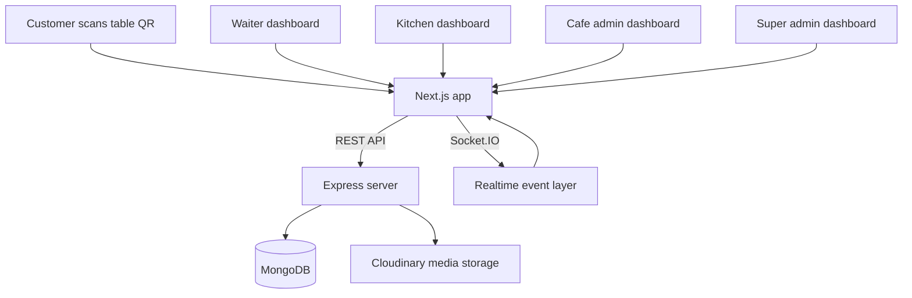

# QRDine

<p align="center">
  <strong>QR-based cafe ordering software with live kitchen flow, staff dashboards, analytics, and branded customer experiences.</strong>
</p>

<p align="center">
  
  
  
  
  
</p>

---

## Overview

QRDine is a full-stack cafe and restaurant ordering platform built around the table QR workflow.

Customers scan a table QR, enter the cafe menu, add items to cart, place an order, and track it live. At the same time, waiters, kitchen staff, cafe admins, and super admins each get their own focused workspace to manage service, operations, and analytics.

This repository includes:

- A branded Next.js frontend with separate customer and staff experiences
- An Express + MongoDB backend with role-based APIs
- Realtime order broadcasting using Socket.IO
- QR generation and secure table-token validation
- Admin tools for menu uploads, table setup, staff creation, and cafe customization

## Why This Project Stands Out

- Table-first ordering flow instead of generic delivery-style checkout
- Multi-role product surface: customer, waiter, kitchen, cafe admin, super admin
- Live order status updates for both staff and guests
- Branded marketing/landing experience for the cafe itself
- Menu management with image uploads and CSV bulk import
- Built-in analytics, order history, customer favorites, and payment support

## Core Features

### Customer Experience

- QR-based entry into a cafe-specific menu
- Table-aware browsing, cart, and checkout flow
- Live order tracking page with realtime updates
- Customer session persistence tied to short-lived secure cookies
- Favorite items surfaced after prior completed orders
- Table guard protection so guests must use valid QR/table links
- UPI QR support on the order status screen

### Staff Experience

- Waiter dashboard with live incoming orders and readiness updates
- Kitchen dashboard for preparation flow and order progression
- Admin dashboard for menu, tables, cafe settings, analytics, and staff management
- Super admin dashboard for multi-cafe control and cross-cafe analytics
- Dedicated order history pages for waiter, kitchen, and admin workflows
- Sound and browser-notification helpers for faster staff response

### Admin and Operations

- Create and manage cafes
- Create and manage tables
- Generate table QR links and QR code assets
- Upload menu images through Cloudinary
- Bulk preview and upload menu items from CSV
- Configure taxes, discounts, branding, colors, and venue metadata
- Maintain showcase highlights, community notes, and non-smoking gallery images
- Seed demo users for local development

### Platform and Security

- JWT authentication for staff users
- Optional OTP request and verify endpoints for future phone-based flows
- Secure table token signing and verification
- Tenant-aware socket room access for staff
- CORS allowlist support for local and deployed environments
- Health check endpoints for frontend and backend

## Product Surfaces

| Surface | Path |
| --- | --- |
| Marketing / cafe showcase | `/` |
| Universal login | `/login` |
| Customer cafe entry | `/:cafeId` |
| Customer menu | `/:cafeId/menu` |
| Customer cart | `/:cafeId/cart` |
| Customer orders | `/:cafeId/orders` |
| Customer order tracking | `/:cafeId/order/:orderId` |
| Waiter dashboard | `/waiter` |
| Kitchen dashboard | `/kitchen` |
| Cafe admin dashboard | `/admin/menu` |
| Super admin dashboard | `/super-admin` |

## Role Matrix

| Role | Main Capabilities |
| --- | --- |
| Customer | Browse menu, place table order, track status live, revisit favorites |
| Staff / Waiter | Watch active orders, handle service flow, review history |
| Kitchen | Manage prep queue, update statuses, review completed history |
| Cafe Admin | Manage menu, QR tables, media, branding, analytics, staff accounts |
| Super Admin | Manage cafes, view overview metrics, inspect system-wide analytics |

## Architecture



## Tech Stack

| Layer | Stack |
| --- | --- |
| Frontend | Next.js 16, React 18, Tailwind CSS, Framer Motion, Recharts |
| Backend | Node.js, Express 5, MongoDB, Mongoose |
| Realtime | Socket.IO |
| Media | Cloudinary, Multer, Sharp |
| Auth | JWT, cookie-based customer sessions, optional future-ready OTP endpoints |
| Utilities | QRCode generation, CSV parsing |

## Repository Structure

```text
.
|-- next-frontend
|   |-- app
|   |-- components
|   |-- lib
|   |-- public
|   `-- test
|-- server
|   |-- config
|   |-- controllers
|   |-- middleware
|   |-- models
|   |-- realtime
|   |-- routes
|   |-- scripts
|   |-- test
|   `-- utils
`-- README.md
```

## Local Setup

### 1. Install dependencies

```bash
cd next-frontend
npm install

cd ../server
npm install
```

### 2. Configure environment variables

Create these files before running locally.

#### Frontend: `next-frontend/.env.local`

```env
NEXT_PUBLIC_API_BASE_URL=http://localhost:5000
NEXT_PUBLIC_CLOUDINARY_CLOUD_NAME=your_cloudinary_cloud_name
NEXT_PUBLIC_CUSTOMER_APP_URL=http://localhost:3000
NEXT_PUBLIC_SHOWCASE_CAFE_ID=optional_showcase_cafe_id
NEXT_PUBLIC_VENUE_ID=optional_fallback_showcase_cafe_id
```

#### Backend: `server/.env`

```env
MONGODB_URI=your_mongodb_connection_string
PORT=5000
JWT_SECRET=your_jwt_secret
CUSTOMER_JWT_SECRET=optional_customer_session_secret
TABLE_QR_SECRET=optional_table_qr_secret
CORS_ORIGINS=http://localhost:3000,http://localhost:5000
CUSTOMER_BASE_URL=http://localhost:3000

CLOUDINARY_CLOUD_NAME=your_cloudinary_cloud_name
CLOUDINARY_API_KEY=your_cloudinary_api_key
CLOUDINARY_API_SECRET=your_cloudinary_api_secret
CLOUDINARY_URL=cloudinary://<key>:<secret>@<cloud_name>

DEFAULT_CAFE_ID=optional_default_cafe_id
REDIS_URL=optional_redis_connection_string
SESSION_TTL_SECONDS=21600
CUSTOMER_ORDER_TTL_SECONDS=604800
SESSION_ORDER_LIMIT=20
CUSTOMER_ORDER_LIMIT=10
NODE_ENV=development
```

Optional only, not required for the current customer ordering flow:

```env
OTP_TTL_SECONDS=300
OTP_MAX_ATTEMPTS=5
```

## Running The App

### Backend

```bash
cd server
npm run start
```

Runs on `http://localhost:5000`

### Frontend

```bash
cd next-frontend
npm run dev
```

Runs on `http://localhost:3000`

## Seed Demo Accounts

```bash
cd server
npm run seed:users
```

Default local credentials created by the seed script:

| Role | Username | Password |
| --- | --- | --- |
| Cafe Admin | `admin` | `Admin@123` |
| Kitchen | `chef` | `Chef@123` |
| Waiter | `waiter` | `Waiter@123` |

## Scripts

### Frontend

| Command | Purpose |
| --- | --- |
| `npm run dev` | Start local Next.js dev server |
| `npm run build` | Build production frontend |
| `npm run start` | Run production frontend |
| `npm run lint` | Run linting |
| `npm run test` | Run frontend tests |

### Backend

| Command | Purpose |
| --- | --- |
| `npm run start` | Start backend server |
| `npm run seed:users` | Seed local demo users |
| `npm run test` | Run backend tests |

## API Overview

### Public and customer routes

- `POST /api/auth/login`
- `POST /api/auth/register`
- `POST /api/auth/otp/request`
- `POST /api/auth/otp/verify`
- `GET /api/menu/:cafeId`
- `GET /api/cafe/:id`
- `POST /api/orders`
- `GET /api/orders/:cafeId/mine`
- `GET /api/orders/:cafeId/table/:tableNumber`
- `GET /api/orders/:cafeId/id/:id`
- `GET /api/customers/me`
- `GET /api/customers/me/favorites`
- `GET /api/session/me`
- `GET /api/qr/table`
- `GET /api/qr/verify`
- `GET /api/qr/token`

### Admin routes

- `/api/admin/menu`
- `/api/admin/tables`
- `/api/admin/users`
- `/api/admin/media`
- `/api/admin/cafe`
- `/api/superadmin`

For the full route surface, see the `server/routes` directory.

## Realtime Events

Socket rooms are scoped by cafe. Staff members join with JWT-backed auth; guest clients can join cafe rooms for order-status updates.

Main events:

- `NEW_ORDER`
- `ORDER_UPDATED`
- `ORDER_READY`
- `ORDER_PAID`
- `JOIN_ERROR`

## Deployment Notes

- Frontend is prepared for environment-based API configuration through `NEXT_PUBLIC_API_BASE_URL`
- QR links can point to a dedicated customer domain using `NEXT_PUBLIC_CUSTOMER_APP_URL` or cafe-level overrides
- Backend CORS can be expanded with `CORS_ORIGINS`
- Cloudinary support is already wired for hosted media
- Redis is optional but recommended for cross-instance session restore and hot order/session caching via `REDIS_URL`
- `manifest.json` and `sw.js` are present for a lightweight installable web-app base

## Testing

This repo already includes:

- Frontend tests for visit-session behavior
- Backend tests for customer session token rules

Run them with:

```bash
cd next-frontend
npm run test

cd ../server
npm run test
```

## Good Fit For

- Cafes with QR-based dine-in ordering
- Multi-role restaurant operations
- Branded cafe websites that still connect to live in-venue service
- Teams that want one codebase for guest flow and staff flow

---

<p align="center">
  Built for faster table service, clearer kitchen coordination, and a more premium in-cafe ordering experience.
</p>
